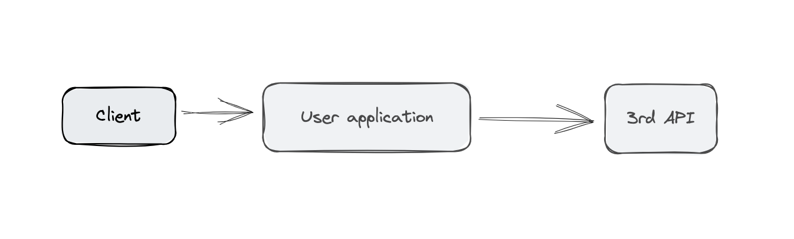

# Spring Boot 3 AOP DEMO

## Description

This is a demo project of spring boot 3 with aop.

Code: `JTSP - 2 - 4 - 1`

## Architecture


Instead of calling real DB, we are calling a 3rd party API.

## Tech stack

+ Spring Boot 3
+ Swagger OpenAPI
+ Spring Validator
+ Spring AOP


## Type of Exception

API: PUT `/users/-1`
```java
@PutMapping("/{id}") // PUT localhost:8080/users/1
public ResponseEntity<User> updateUserById(@PathVariable @Min(1L) Long id, @RequestBody User user) {
    return ResponseEntity.ok(userService.updateUserById(id, user).get());
}
```
Exception: `org.springframework.web.method.annotation.HandlerMethodValidationException`

---

API: POST `/users` with not valid DTO
```java
@PostMapping // POST localhost:8080/users
public ResponseEntity<User> createNewUser(@Valid @RequestBody User user) {
    return ResponseEntity.ok(userService.createNewUser(user).get());
}
```
Exception: `org.springframework.web.bind.MethodArgumentNotValidException`

---

API: DELETE `/users` 
```java
@PostMapping // POST localhost:8080/users
public ResponseEntity<User> createNewUser(@Valid @RequestBody User user) {
    return ResponseEntity.ok(userService.createNewUser(user).get());
}
```
Exception: `org.springframework.web.HttpRequestMethodNotSupportedException`

## Common AOP Usage

### Auditing API Calls
Auditing can track who performed an action and when it was performed. Here's an example aspect for auditing API calls.

```java
package com.jtsp.springaopdemo.aspect;

import org.aspectj.lang.JoinPoint;
import org.aspectj.lang.annotation.AfterReturning;
import org.aspectj.lang.annotation.Aspect;
import org.slf4j.Logger;
import org.slf4j.LoggerFactory;
import org.springframework.stereotype.Component;

import java.time.LocalDateTime;

@Aspect
@Component
public class AuditAspect {

    private static final Logger logger = LoggerFactory.getLogger(AuditAspect.class);

    @AfterReturning("execution(* com.jtsp.springaopdemo.controller.*.*(..))")
    public void auditApiCall(JoinPoint joinPoint) {
        String methodName = joinPoint.getSignature().getName();
        String userName = "Anonymous"; // You can fetch the authenticated user here
        LocalDateTime timestamp = LocalDateTime.now();

        logger.info("Method {} called by {} at {}", methodName, userName, timestamp);
    }
}

```

### Security Checks

```java
package com.jtsp.springaopdemo.aspect;

import org.aspectj.lang.ProceedingJoinPoint;
import org.aspectj.lang.annotation.Around;
import org.aspectj.lang.annotation.Aspect;
import org.springframework.stereotype.Component;

@Aspect
@Component
public class SecurityAspect {

    @Around("execution(* com.jtsp.springaopdemo.service.*.*(..))")
    public Object secureMethods(ProceedingJoinPoint joinPoint) throws Throwable {
        // Perform security checks here (e.g., authentication, authorization)
        boolean isAuthenticated = checkAuthentication();

        if (!isAuthenticated) {
            throw new SecurityException("User not authenticated");
        }

        return joinPoint.proceed();
    }

    private boolean checkAuthentication() {
        // Logic to check authentication
        return true;
    }
}
```

### Transaction Management
```java
package com.jtsp.springaopdemo.aspect;

import org.aspectj.lang.ProceedingJoinPoint;
import org.aspectj.lang.annotation.Around;
import org.aspectj.lang.annotation.Aspect;
import org.springframework.stereotype.Component;
import org.springframework.transaction.annotation.Transactional;

@Aspect
@Component
public class TransactionAspect {

    @Around("execution(* com.jtsp.springaopdemo.service.*.*(..))")
    @Transactional
    public Object manageTransaction(ProceedingJoinPoint joinPoint) throws Throwable {
        return joinPoint.proceed();
    }
}

```


###  Performance Monitoring
```java
package com.jtsp.springaopdemo.aspect;

import org.aspectj.lang.ProceedingJoinPoint;
import org.aspectj.lang.annotation.Around;
import org.aspectj.lang.annotation.Aspect;
import org.slf4j.Logger;
import org.slf4j.LoggerFactory;
import org.springframework.stereotype.Component;

@Aspect
@Component
public class PerformanceAspect {

    private static final Logger logger = LoggerFactory.getLogger(PerformanceAspect.class);

    @Around("execution(* com.jtsp.springaopdemo.service.*.*(..))")
    public Object monitorPerformance(ProceedingJoinPoint joinPoint) throws Throwable {
        long start = System.currentTimeMillis();

        Object result = joinPoint.proceed();

        long elapsedTime = System.currentTimeMillis() - start;
        logger.info("Execution time of {} with args {} :: {} ms",
                joinPoint.getSignature(), joinPoint.getArgs(), elapsedTime);

        return result;
    }
}

```
### Caching

```java
package com.jtsp.springaopdemo.aspect;

import org.aspectj.lang.ProceedingJoinPoint;
import org.aspectj.lang.annotation.Around;
import org.aspectj.lang.annotation.Aspect;
import org.springframework.cache.annotation.Cacheable;
import org.springframework.stereotype.Component;

@Aspect
@Component
public class CachingAspect {

    @Around("@annotation(cacheable)")
    public Object cacheResult(ProceedingJoinPoint joinPoint, Cacheable cacheable) throws Throwable {
        // Implement caching logic here
        // Example: Check if result is in cache, if not, call the method and store the result in cache
        String key = generateCacheKey(joinPoint);
        Object cachedResult = getFromCache(key);

        if (cachedResult != null) {
            return cachedResult;
        }

        Object result = joinPoint.proceed();
        putInCache(key, result);

        return result;
    }

    private String generateCacheKey(ProceedingJoinPoint joinPoint) {
        // Generate a unique cache key based on method name and arguments
        return joinPoint.getSignature().toString() + ":" + joinPoint.getArgs().toString();
    }

    private Object getFromCache(String key) {
        // Retrieve the result from cache
        return null; // Implement cache retrieval logic
    }

    private void putInCache(String key, Object result) {
        // Store the result in cache
        // Implement cache storage logic
    }
}
```
